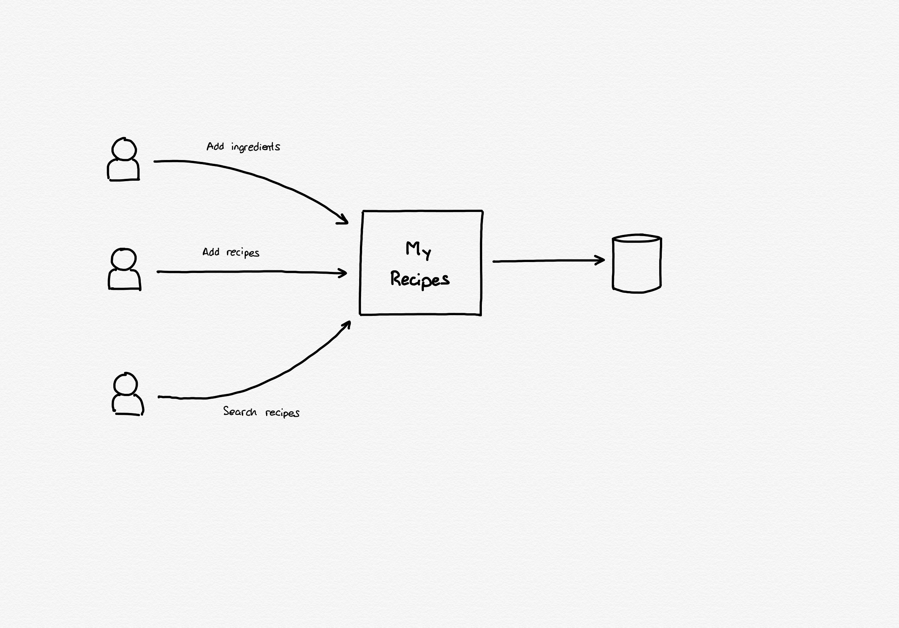
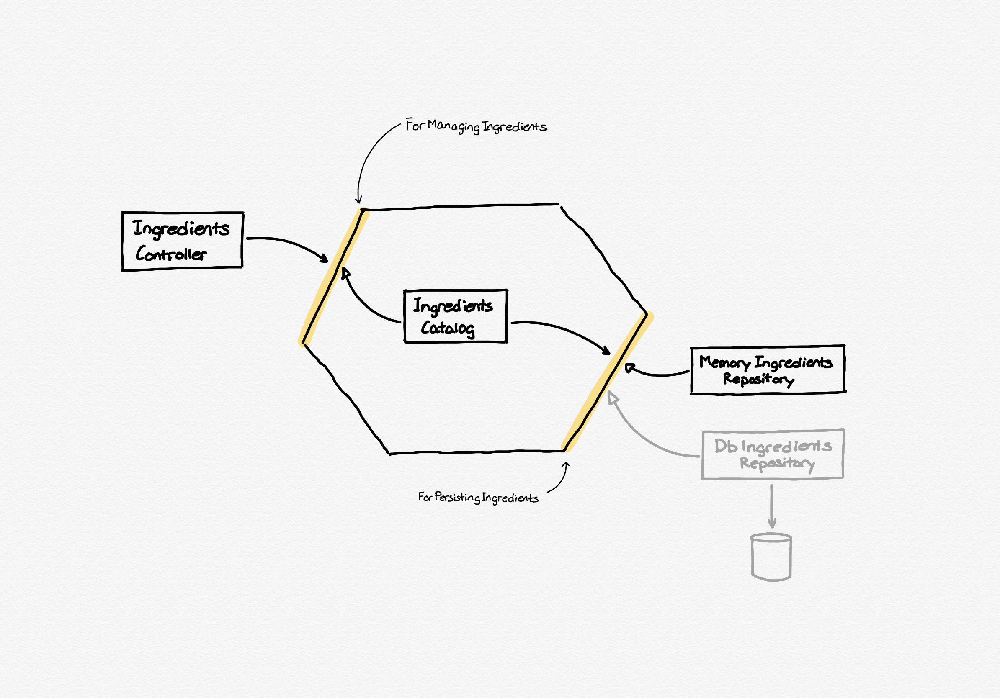
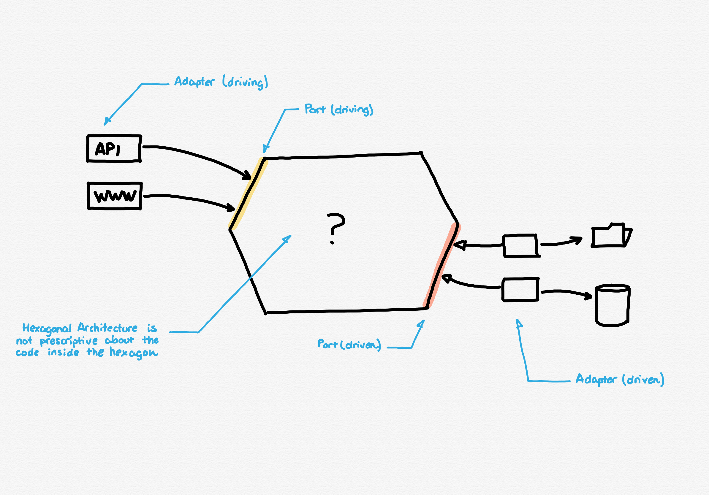
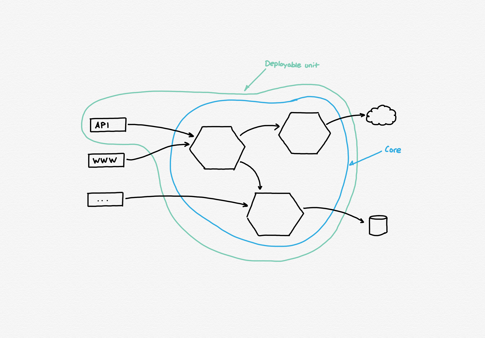

## Disclaimer

This project is just a sandbox to learn and practice, it is not production-ready code, and any use of it is under your own responsibility.

## :bulb: About

The main idea is to have a recipes (like real food recipes :-D) book, with some special features, like being able to search for recipes given the ingredients seasonality, or given a list of available ingredients. Under this premise I will create a larger application where I can practice and test some ideas that I can later translate to real projects.



### Some premises

There are some common premises along the entire project:

1. As it worked pretty well for me in the past, the core uses Hexagonal Architecture to demonstrate the decoupling between third-parties and the business code.
2. The project will use the monorepo practices.
3. TBD

## :classical_building: The Solution Architecture

### Implicit driving ports definition

Because usually there are no more than one implementation from the driving ports, and defining the interface explicitly using the `interface` keyword, all driving ports are defined by the implementing class interface (like in the API, not the `interface` keyword)



The implementing class has an interface but doesn't use the `implements` keyword for the original port name.

```java
@Service
public class IngredientsCatalog {
    ...
}
```

## Miscelaneous

### Hexagonal Architecture definitions

Hexagonal Architecture is one of those topics that are pretty simple, but the interpretation of the reader could lead to some differences. Here is a brief explanation of the basic components.



* Driving adapter: it is called "driving" because it is the starter of a "request", and the adapter is responsible to adapt between the technology and the application, e.g. HTTP Request to Java business code invocation.
* Driving port: it is the interface to invoke the application in the "left side", and the point that isolates the business code from the "external world".
* Driven port: it is the equivalent to the driving port but on the right side, that means that it is used because a request was started on the left side.
* Driven adapter: it is the equivalent to the driving adapter, and it is usually implemented as data layers, clients to connect to third parties, etc.

One important detail in Hexagonal Architecture is that it is not prescriptive about how to implement the business code, it could be DDD or spaghetti. Obviously the better it is the more maintainable the system is.



Over the years my interpretation about what a deployable element and a hexagon is changed, and right now I see the hexagons as a modular and reusable pieces that together with some adapters could be wrapped into a deployable artifact.
