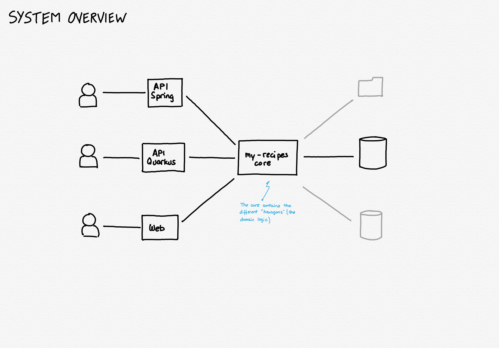

This project is just a sandbox to learn and practice, it is not production-ready code, and any use of it you do is completely under your own responsibility.

## Functional description

I've always had the idea to keep a recipes book, but with some special features, like being able to search for recipes given the seasonality of its ingredients, or given a list of available ingredients. So this is a good idea that allows me to create an entire application doing that while I can learn and practice.



Three common use cases will be:
1. Add/Edit ingredients
2. Add/Edit recipes
3. Search recipes

## Interestring commands

```shell
./gradlew bootRun
```
